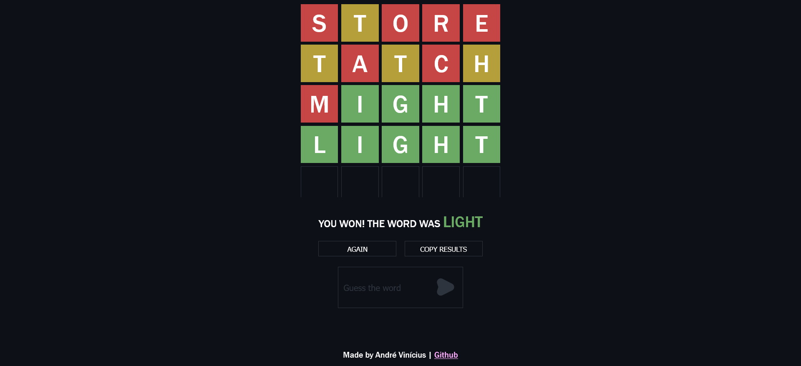

# Wordle Crafter

Craft puzzles similar to Josh Wardle's Wordle and share them via URL.

 

### Supported languages

- English
- Portuguese

### Requirements

- Most recent version of Node.js

### Setup

##### Clone the repository and access its directory through the terminal

```sh
git clone <repository url>
cd <folder path>
```

2. Install dependencies

```sh
npm install
```

3. Start development server

```sh
npm run dev
```
